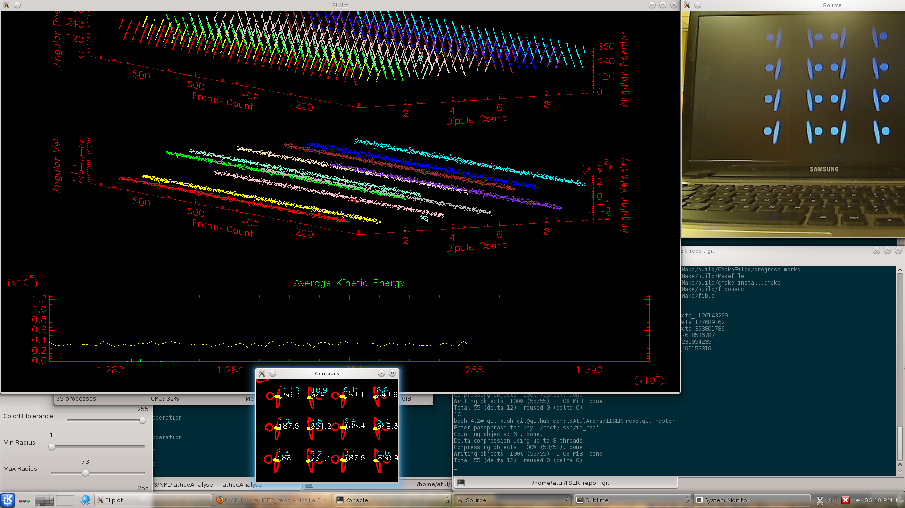

OVERVIEW
--

There are three parts to this

1. latticeAnalyser aka The Lattice Analyser: This analyses the positions and angular velocities of the dipoles and controls the noise current accordingly to simulate temperature.

2. temperature aka Temperature: This is the hardware for getting the right currents to flow at the right times, to get the temperature up and running.

3. holyText aka The Documentation: Well this is supposedly where I will make whatever presentations etc. for this project. So should be good eventually!

SUMMER '13 TIMELINE
--
** July 26, Friday: Not well again. Tried to work on the documentation

* July 25, Thursday: Working on setting up latex on linux along with dOxygen for documentation. The latex bit failed. There were various problems even after painfully installing TeXlive to work with ST3, while compiling the classic thesis template.

* July 24, Wednesday: [Project Milestone] Completed testing with a 2x2 lattice, with energy pumping and it worked just fine! Obviously it required a lot of debugging, for electronics never works at once. Plus there were other software issues.

* July 23, Tuesday: [important day] Finalized the HSV colour filter.  Further added calculation of temperature using a timed average. Added support for making the pin configurations readable from file. Then temperature ran into issues and was fixed (int char problem) and put the last piece of the puzzle.

* July 22, Monday: Figured out the best way to make temperature take generic inputs for triggering the electromagnets. Further the ellipse detection was made more strict to dis-allow ellipse/circles that are not of suitable dimensions. Further worked on an HSV colour filter instead of the RGB model to support higher speeds.

** July 20 and 21, Saturday and Sunday: Working on the documentation.

** July 18 and 19, Thursday and Friday: (Not well) [at home] Tried to setup plplot in windows using CMake and VS11 (2012) failed. Tried with minGW that too failed. Tried upgrading Sublime Text 3 to work with latex, that too failed. Working on updating the documentation. Also worked on the secondary project with some success.

* July 17, Wednesday: (Not well in the morning) Physically completed construction of four new dipoles, ready to be tested as a 2x2 lattice.

* July 16, Tuesday: The modding problem was fixed (using modular arithmetic) in the dipole angle detection also. Dipole oscillations were setup with energy pumping using the temperature. Another dipole was also tested. Colour correction was changed from being based on RGB to HSV. This improved dipole detection at higher angular velocities.

* July 15, Monday: Attempted an upgrade of the gstreamer plugin which failed.'tempreature' was made functional again and damping was tested using the realtime graphs. The modding problem in the angle detection for deciding when to fire the electromagnet was also fixed.

** July 12-14, Friday to Sunday: Working on a secondary project.

* July 11, Thursday: A simple two point setup was created with one needle held from the top and bottom (used magnets to start with then removed them for testing damping) using glass slides and it seems to be better than what we've seen so far. Further, with plastic it is highly damped.  However, we tried to mount the needle on both sides with screws (for a metal cavity) and the damping was very sensitive to the amount of pressure. Further the idea is hard to implement cause the vision detection can't be done on it then, atleast the way we're doing it now. Also, camera calibration was implemented to correct for camera defects using a chessboard pattern. The systematic errors didn't disappear.

* July 10, Wednesday: A little more of error analysis and dipole air elevation setup for all the dipoles was done (the fourth was setup and left for drying). Used an interesting method for making the dipoles. It was found during tests that with the heavy bottom, the needle setup (with the pointed edge up!) had almost the same damping as that of the air elevated setup. Further it was concluded that more accuracy is required for the air elevation setup to work properly. It was hypothesized that the main source of 'angular friction' were the guides that held the needle upright and not the needle tip.

* July 9, Tuesday: Did the error analysis. Used a hell lot of GNUplot. Experimentally (that is in the physical world) setup the third dipole.

* July 8, Monday: Working on writing a method to record all the observations into a file. Further figured out what and how to do, for estimating errors and accounting for the systematic errors. Further started the dipole modifications for setting up the first dipole for air elevation. This was done and found to have worked rather well. Better than the needle counter-parts (but no reliable comparison can be made yet, the systems compared weren't 'identical enough')

** July 6 and 7, Weekend: Spent on an alternate project

* July 5, Friday: Two interesting things were done; one the long lingering bug in the modding was resolved using assistance from the atan2 approximation. Second, the aluminium disk was fitted on a needle and left to dry. Exciting cause that would finally conclude whether the air elevation method could work or not.

* July 4, Thursday: Cmake was fiddled around with and a graph for kinetic energy added. There was a periodic shoot up in the value which was caused by a mod problem in the angles. It was rectified. The dipole's hardware modification has also been initiated.

* July 3, Wednesday: Realised that a DIY air hockey table would be a better way of searching and it was. In the latticeAnalyser implimented dual graphs (one for the angular position and the other for the velocity). Also implemented the atan2 function for correcting the angle problem that used to occur.

* July 2, Tuesday: Figured how to use plplot, the basics. Got it up and running for 3d points and surfaces. Figured how to use grids, labels and enabling realtime support. Built and merged a minimalistic version of the same to the latticeAnalyser

* July 1, Monday: Air hockey tables were searched for some toy ones found too. Attempted the writing of an algorithm for auto numbering of points in a lattice. Figured it was not straight forward to implement with the usual C++ syntax. Will instead made provision (partially) for swapping manually. Also, plplot, a suitable plotting library was found and installed.

** June 9 - 21 : Monsoon School; Physics of Life, NCBS Bengaluru

* June 7, Friday: [Project Milestone] It was realized that neither the sachetIO was required (the data length can be increased to 128 bytes without any difficulty just by changing the report length in the USB HID configurations), nor was a current amplifier. However, today a dipole was made to turn continuously using the latticeAnalyser and the temperature. It was found that the current is more than sufficient for the current task. Further, for now, pins of the MCU can directly be used. Stage one has been accomplished. Now it remains to reduce friction (for the damping is far too high) and to finalize the circuit for the setup. Then the actual experiment begins.
* * June 6, Thursday: Added a buffer function to the sachetIO library. Looked up methods for current amplification
* * June 5, Wednesday: Created and tested sachetIO, a library for sending large arrays, required for communicating over HID USB. This was debugged and tested. Non buffered version is ready.
* June 4, Tuesday: Succesffully linked the latticeAnalyser (after compiling half of it with C, the rest with C++). Modified temperature to include a simple protocol and using that controlled the electromagnet of a single dipole from latticeAnalyser.
* June 3, Monday: Started with the hardware. Configured SP12 (the programmer) then bootloadHID, flashed a board to support a bootloadHID interface.

** June 1 and 2, Saturday and Sunday: Updated the documentation

* May 31, Friday: Tried all sorts of methods for air suspension which failed to work satisfactorily. Despite suspension, we couldn't achieve a state that had low enough torque (either perturbation or friction, atleast one was visible)
* May 30, Thursday: The vacuum cleaner setup had to be used. The box was drilled accordingly and the test failed partially anyway. Which is to say that if it is light enough, the suspension does take place, however the vertical oscillations can not be removed.
* May 29, Wednesday: The pump was built but it failed the test. The air pressure generated was negligible. i7 was configured alongside and the Lattice Analyser was built on it (had to make the multi threading optional using macros) using OpenCV with OpenTBB. Tests were run and it was found to be fast enough for an 8 x 8 dipole matrix.
* May 28, Tuesday: Multi-threading retried, wasn't quite functional last time. Looked up various techniques for multi-threading and froze an algorithm. The pump couldn't be built for parts weren't available.
* May 27, Monday: Multithreading attempted and succeeded, although not a very good release. Making progress in installing IPP.

* May 21 - 26, Tuesday to Sunday: Not well; Succeeded in compiling the code in windows. It's slower. Looked up multithreading using C++ 11

* May 20, Monday: Time Lag measured and found to be roughly 3 to 4 frames behind. Not quite acceptable. Attempting to install OpenCV with IPP

** May 18 and 19, Saturday and Sunday: Completing the documentation for the same. Thought of a way of testing the time lag.

* May 17, Friday: The algorithm was successfully completed to measure 360 degrees. PLUS, completed the frame recording, identification of each dipole as unique and dumping the data out in file AND its testing with uniform motion which it passed with flying colours (which is to say in the visible range!, because proper standard deviation tests haven't quite been done yet) The vision part of the anlyser is almost done.

* May 16, Thursday: Working on dipole detection. The algorithm has started to work partially. It still does a mod 180 detection.

* May 15, Wednesday: The magnetic lifting worked, but friction reduction failed. Rather interestingly the dipole would align to the suspension magnet's field. Plus, today the spot recognition algorithm was finalized and it seemd to be perfect.

* May 14, Tuesday: Trying to get the webcam to work, eventually acceded to installing everything on a desktop machine. Worked on reducing the friction further

* May 13, Monday: Completed the proof of concept version of the latticeAnlyser. Tomorrow we plan to print the coloured ovals and test

** May 11 and 12, Saturday and Sunday: Read the opencv tutorials when the algorithms started appearing and fitting the bill!

* May 10, Friday: Continued with the setup, finetuning, installing other applications, making a documentation alongside for better support next time, added a shared folder between windows and linux

* May 9, Thursday: Managed to get a few things up and running, still setting up ubuntu to run with hardware acceleration, failed at trying to get the webcam to work, installed the build tools, opencv etc.

* May 8, Wednesday: Met with Dr. X (forgot the name of the person at NPL I'm working with) and concluded OpenCV and linux are what I'll use. Initiated the downloading of required applications, including virtual box and an ubuntu image
