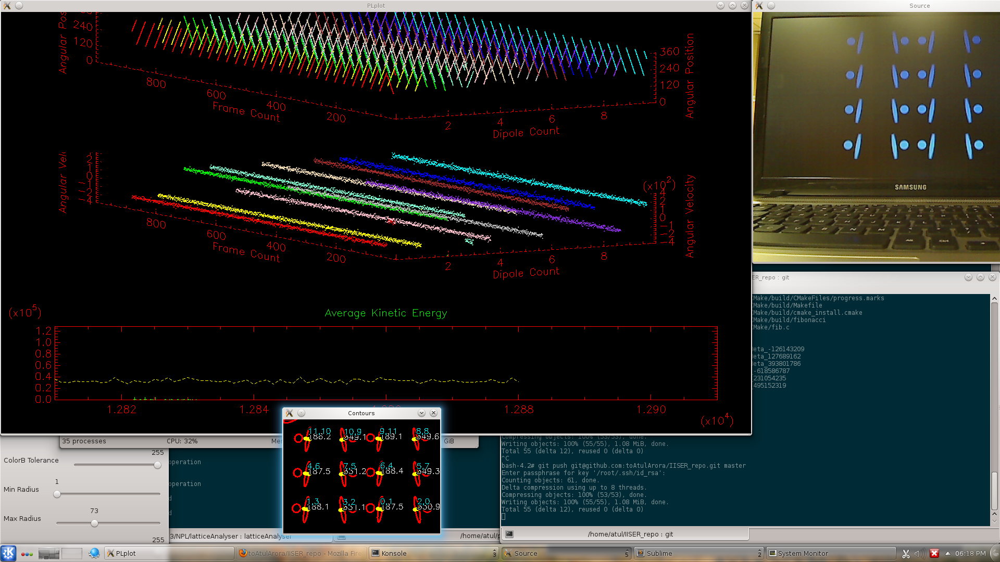

This is intended to run on a Linux (preferably Ubuntu) computer. To compile any of the code, you would need to setup OpenCV 2.4 (or later if it's compatible). Once done, fire up a terminal, goto the release directory and go

./latticeAnalyser

Here are (more) screenshots

Good luck!